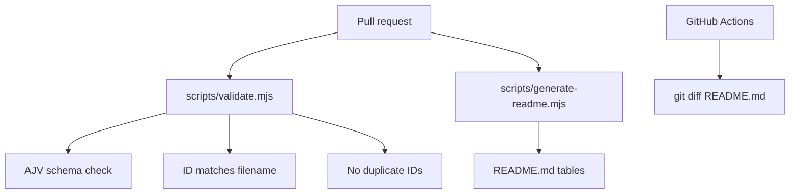

# Entry schema

The canonical schema lives at [`schema/entry.schema.json`](../../schema/entry.schema.json). It defines one rated tool per JSON file under `data/entries/`.

## Design goals

- **Portable** — fork the schema and scripts for any community catalog
- **Validated** — AJV checks every PR against the schema
- **Transparent** — ratings are plain JSON in git, not a proprietary database
- **Computed overall** — prevents hand-tuning the headline score

## Categories

| Value | Use for |
| --- | --- |
| `mcp-server` | Model Context Protocol servers |
| `agent-skill` | Claude/Cursor Agent Skills (`SKILL.md`) |
| `cursor-rule` | Cursor rules and `.cursor/rules` patterns |
| `hook` | Cursor/Claude hooks and automation |
| `plugin` | Plugin marketplaces and extension bundles |
| `cli` | Terminal CLIs (`claude`, `cursor` agent) |
| `other` | Ecosystem tools that do not fit above |

## Compatible clients

| Value | Product |
| --- | --- |
| `claude-code` | Claude Code CLI |
| `cursor` | Cursor IDE |
| `claude-desktop` | Claude Desktop |
| `windsurf` | Windsurf |

## Ratings object

```json
{
  "documentation": 4,
  "maintenance": 4,
  "utility": 5,
  "trust": 4
}
```

Overall score formula (implemented in `scripts/validate.mjs`):

```
overall = round((documentation + maintenance + utility + trust) / 4, 1)
```

## Validation pipeline



## Forking for your community

1. Copy `schema/`, `scripts/`, and `.github/workflows/ci.yml`.
2. Replace `data/entries/` with your catalog.
3. Customize category enums in the schema if needed.
4. Keep the `<!-- STATS:START -->` / `<!-- RATINGS:END -->` markers in README.

## Versioning

Schema changes should be tagged (`v1.0.0`, `v1.1.0`) so forks can pin a stable contract. See `.github/workflows/release.yml`.
